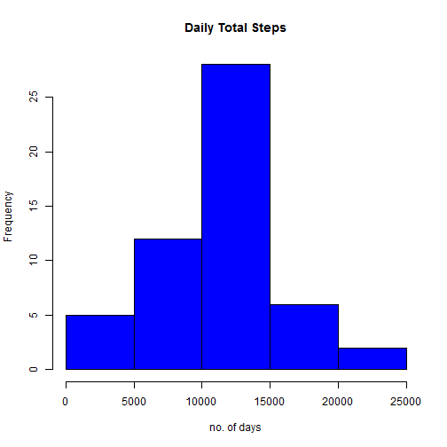
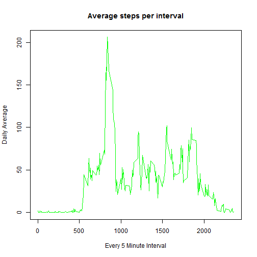
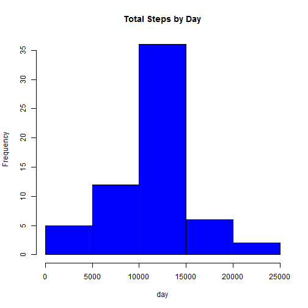

##Loading and Processing the Data


```r
library(lattice)

rractivity <- read.csv("RRactivity.csv", header = TRUE, 
                       colClasses = c("numeric", "character", "numeric"),
                       sep = ",")

head(rractivity)
```

```
##   steps       date interval
## 1    NA 2012-10-01        0
## 2    NA 2012-10-01        5
## 3    NA 2012-10-01       10
## 4    NA 2012-10-01       15
## 5    NA 2012-10-01       20
## 6    NA 2012-10-01       25
```

```r
rractivity$date <- as.Date(rractivity$date, "%Y-%m-%d")
```

##What is mean total number of steps taken per day?

###total steps


```r
totalsteps <- aggregate(steps ~ date, data=rractivity, sum, na.rm=TRUE)
```

###Histogram


```r
hist (totalsteps$steps, main = "Daily Total Steps", xlab = "no. of days", col = "blue")
```

 

###Mean

```r
mean(totalsteps$steps)
```

```
## [1] 10766
```

###Median

```r
median(totalsteps$steps)
```

```
## [1] 10765
```

##What is the average daily activity pattern?

###Time Series Plot


```r
time_series_plot <- tapply (rractivity$steps, rractivity$interval, mean, na.rm = TRUE)

plot (row.names(time_series_plot), time_series_plot, type = "l", 
      xlab = "Every 5 Minute Interval", ylab = "Daily Average",
      main = "Average steps per interval", col = "green")
```

 


```r
max_5min_interval <- which.max(time_series_plot)
names(max_5min_interval)
```

```
## [1] "835"
```

##Imputing missing values


```r
totalNA_rractivity <- sum(is.na(rractivity))
totalNA_rractivity
```

```
## [1] 2304
```

###Filling NAs


```r
avgsteps <- aggregate(steps ~ interval, data = rractivity, FUN = mean)
fillingNA <- numeric ()
for (i in 1:nrow(rractivity)) {
        obs <- rractivity [i, ]
        if (is.na(obs$steps)) {
                steps <- subset(avgsteps, interval == obs$interval)$steps
        } else {
                steps <- obs$steps
        }
        fillingNA <- c(fillingNA, steps)
}
```

###Creating new dataset with no NAs


```r
new_rractivity <- rractivity
new_rractivity$steps <- fillingNA 
```

###Histogram of total steps by day


```r
stepstotalbyday <- aggregate(steps ~ date, data = new_rractivity, sum, na.rm = TRUE)

hist(stepstotalbyday$steps, main = "Total Steps by Day", xlab = "day", col = "blue")
```

 

###Mean


```r
mean(stepstotalbyday$steps)
```

```
## [1] 10766
```

###Median

```r
median(stepstotalbyday$steps)
```

```
## [1] 10766
```

##Differences in activity between weekdays and weekends

I am using the filled dataset for this part (new_rractivity)


```r
day <- weekdays(new_rractivity$date)
daylevel <- vector()
for (i in 1:nrow(new_rractivity)) {
        if (day[i] == "Saturday") {
                daylevel[i] <- "Weekend"
        } else if (day[i] == "Sunday") {
                daylevel[i] <- "Weekend"
        } else {
                daylevel[i] <- "Weekday"
        }
}
new_rractivity$daylevel <- daylevel
new_rractivity$daylevel <- factor(new_rractivity$daylevel)

stepsByDay <- aggregate(steps ~ interval + daylevel, data = new_rractivity, mean)
names(stepsByDay) <- c("interval", "daylevel", "steps")
```

###Weekend vs Weekday Plot


```r
xyplot(steps ~ interval | daylevel, stepsByDay, type = "l", layout = c(1, 2), xlab = "Interval", ylab = "Number of steps")
```

 

The graph shows that during weekdays the number of steps taken are high only at the start of day. While during weekends, there is significant activity across the day
